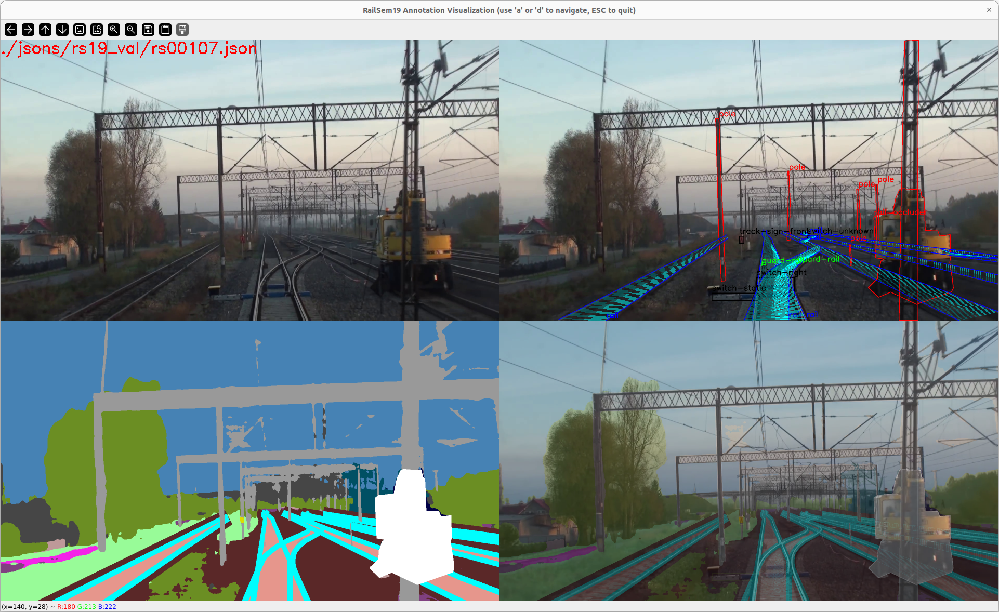
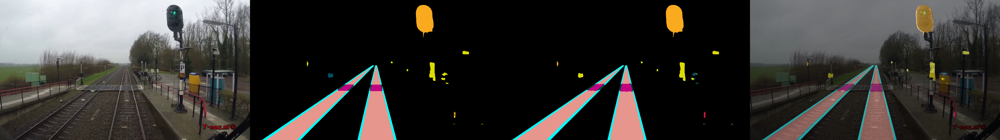
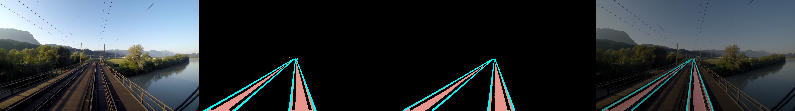
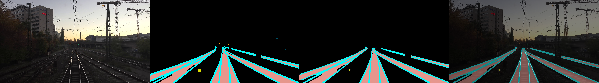

# Railsem19 Semantic Segmentation with DeepLabV3Plus


## 🌟 Introduction

This project aims to perform semantic segmentation on the Railsem19 dataset using the DeepLabV3Plus model. The goal is to classify rail and track as well as detect other railway-related structures to improve object detection performance in various railway environments.

## 🏆 Project Goal

- Perform semantic segmentation on the Railsem19 dataset.
- Classify rail and track, and detect other railway-related structures.
- Evaluate and improve object detection performance in railway environments.
- Discuss a dataset construction plan based on the experiments.

## 🤖 Model Reference

- This project uses the DeepLabV3Plus model.
- For more details on the model, visit the following repository: [DeepLabV3Plus for Beginners](https://github.com/J911/DeepLabV3Plus-for-Beginners).

## 📂 Dataset

- Dataset used in this project is the Railsem19 dataset.
- For more information on the dataset, visit: [Railsem19 Dataset](https://www.wilddash.cc/railsem19). 
- This repository provides a visualization tool that complements existing tools.



## 📝 Experiments

Three experiments were conducted in this project:
1. Training only 8 classes excluding the background class.
    - tram-track, rail-track, traffic-light, traffic-sign, on-rails, rail-raised, rail-embedded, human.
2. Training only 8 classes including the background class.
    - Same as above, additionally background.
3. Training with all labels including the background class.

## ⚙️ Settings

### Environment

- **OS**: Ubuntu 18.04.6 LTS
- **GPU**: 4 x NVIDIA RTX2080Ti
- **Python**: 3.8.5
- **PyTorch**: 1.7.1
- **CUDA**: 11.0

### Dataset

- **Train**: 7,650 images (90%), rs00000.jpg ~ rs07649.jpg
- **Validation**: 850 images (10%), rs07650.jpg ~ rs08499.jpg

### Training

- **Encoder**: ResNet101-OS16
- **Epochs**: 200
- **Batch Size**: 4
- **Learning Rate**: 0.01
- **Optimizer**: SGD
- **Scheduler**: CosineAnnealingLR


## 🏃‍♂️ How to Run

Clone the repository:
```bash
git clone https://github.com/yourusername/railsem19-semantic-segmentation.git
cd railsem19-semantic-segmentation
```

### Train
In single GPU
```bash
python train_single.py --batch-size 4 --num-classes 19 
```
In multi GPUs
```bash
$ python -m torch.distributed.launch --nproc_per_node=4 train.py --batch-size 4 --num-classes 19
```

### Evaluate
```bash
$ python evaluate.py --weight ./saved_model/best.pth --num-classes 19
```
Note: this repository doesn't contain checkpoints.

## 🎯 Result

- This repository offers about 60 samples per each task.
- The images are located in outputs directory, name start with bad, good, or merged.
- Below shows only good cases.

### 1. Training only 8 classes excluding the background class.
- Achieved 0.717 mIoU of semantic segmentation learning results for 8 classes on the RailSem19 dataset.
- Ignoring or masking everything except the target object.
- Rail/Tram Track may be confused depending on the terrain. (additional study and Balanced Training required)

Original image, Ground truth, Prediction, Blended(Image+Prediction) in orders




| Class         | IoU   | Class         | IoU   | Class       | IoU   | Class       | IoU   |
|:-------------:|:-----:|:-------------:|:-----:|:-----------:|:-----:|:-----------:|:-----:|
| **tram-track**| 0.7106| **rail-track**| 0.8785| **traffic-light**| 0.7759| **on-rails**| 0.8192|
| **traffic-sign**| 0.5961| **rail-raised**| 0.7597| **human**| 0.6202| **rail-embedded**| 0.5790|
|  **mIoU**             | 0.7174     | -      | -| -           | -     | -           | -     |


### 2. Training only 8 classes including the background class

- Achieved 0.605 mIoU learning results for semantic segmentation with 8 classes and background on RailSem19 dataset.
- All objects other than the target object are processed as background to proceed with learning.
- For classes with insufficient instances, the IoU decreases significantly (traffic-related classes, etc.)

Original image, Ground truth, Prediction, Blended(Image+Prediction) in orders




| Class         | IoU   | Class         | IoU   | Class           | IoU   | Class         | IoU   |
|:-------------:|:-----:|:-------------:|:-----:|:---------------:|:-----:|:-------------:|:-----:|
| **tram-track**| 0.7332| **rail-track**| 0.8611| **traffic-light**| 0.4522| **on-rails**  | 0.5715|
| **traffic-sign**| 0.3348| **rail-raised**| 0.5952| **human**      | 0.4601| **rail-embedded**| 0.4576|
| **background**| 0.9792| **mIoU**      | 0.6050| -               | -     | -             | -     |

### 3. Training with all labels including the background class.

- Achieved 0.578 mIoU of semantic segmentation learning results for all classes on the RailSem19 dataset.
- As all classes are learned, overall IoU decreases (dataset expansion required for smooth learning)

Original image, Ground truth, Prediction, Blended(Image+Prediction) in orders


- Left two columns are the 8 classes used above, and right two columns are the others. 

| Class           | IoU   | Class         | IoU   | Class        | IoU   | Class         | IoU   |
|:---------------:|:-----:|:-------------:|:-----:|:------------:|:-----:|:-------------:|:-----:|
| **tram-track**  | 0.4272| **rail-track**| 0.8381| **road**     | 0.5354| **terrain**   | 0.6277|
| **traffic-light**| 0.5091| **on-rails** | 0.4667| **sidewalk** | 0.5501| **sky**       | 0.9537|
| **traffic-sign**| 0.3491| **rail-raised**| 0.6020| **construction**| 0.7279| **car**       | 0.6825|
| **human**       | 0.5682| **rail-embedded**| 0.3260| **fence**   | 0.5075| **truck**     | 0.1540|
| -               | -     | -             | -     | **pole**     | 0.6240| **trackbed**  | 0.7053|
| -               | -     | -             | -     | **vegetation**| 0.8449| **Total mIoU**| 0.5789|

## 🗣️ Discussion

- Rail-track and rail-raised are found well, but tram-track and on-rails are relatively difficult to find.
- When rail-tracks cross each other, it is easy to find, but when rail-tracks and tram-tracks cross each other, confusion occurs.
- The above problem is believed to be caused by pixel-level class imbalance, therefore, additional research on balanced train techniques is needed.

## 🚀 Future Work

- Address pixel-level class imbalance.
- Experiment with other segmentation models and techniques.
- Expand the dataset to include more diverse railway environments.

## 🙏 Acknowledgments

Special thanks to:
- @J911 for providing invaluable experiences and guidance.
- @Testworks for their support.

